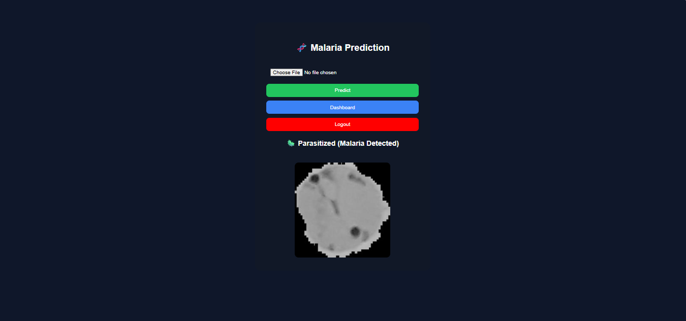
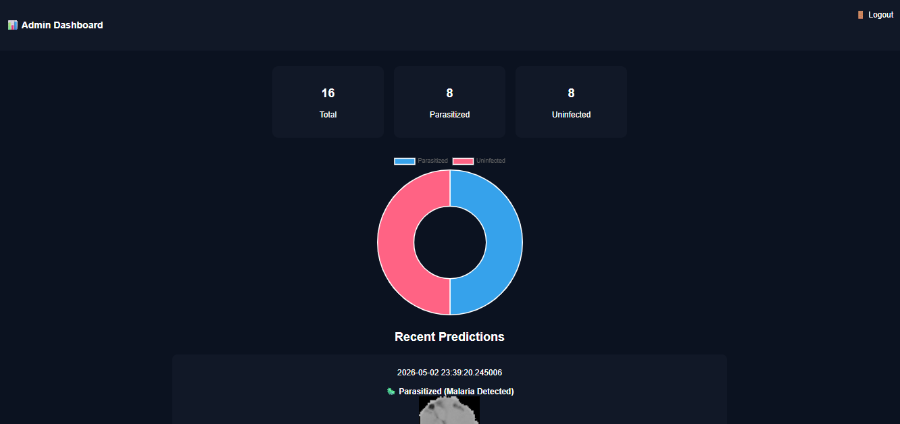

# malaria_app
# 🧬 Malaria Detection System Using Feature Engineering and Stacking Ensemble Learning

## 📌 Abstract

Malaria remains one of the most life-threatening infectious diseases worldwide. Accurate and early detection is essential for effective treatment. This project proposes an intelligent system for malaria detection from microscopic blood cell images using a hybrid machine learning approach that combines feature engineering and ensemble learning.

The system extracts discriminative features using Histogram of Oriented Gradients (HOG), Local Binary Patterns (LBP), and color histograms. These features are fed into a stacking ensemble model composed of Random Forest, Support Vector Machine (SVM), and XGBoost, with Logistic Regression as a meta-classifier.

Experimental results demonstrate strong performance with an accuracy of **91.75%**, indicating the effectiveness of combining handcrafted features with ensemble learning.

---

## 🎯 Keywords

Malaria Detection, Feature Engineering, HOG, LBP, Stacking Ensemble, Machine Learning, Medical Imaging

---

## 🧠 1. Introduction

Malaria diagnosis traditionally relies on manual microscopic examination of blood smears, which is time-consuming and requires expert knowledge. Automated detection systems can assist healthcare professionals by providing fast and reliable predictions.

This project aims to:

* Automate malaria detection using image-based features
* Improve classification accuracy using ensemble learning
* Provide a web-based interface for real-world usability

---

## 🧪 2. Methodology

### 2.1 Dataset

* Source: NIH Malaria Dataset
* Total Samples Used: **4000 images**
* Classes:

  * Uninfected (0)
  * Parasitized (1)

---

### 2.2 Feature Extraction

The system uses three complementary feature extraction techniques:

#### 🔹 HOG (Histogram of Oriented Gradients)

Captures edge and shape information.

#### 🔹 LBP (Local Binary Pattern)

Encodes local texture patterns.

#### 🔹 Color Histogram

Represents color distribution across RGB channels.

➡️ Final feature vector size: **1870 features**

---

### 2.3 Classification Models

The following base models are used:

* Random Forest
* Support Vector Machine (RBF Kernel)
* XGBoost

#### 🔥 Final Model: Stacking Ensemble

A meta-classifier (Logistic Regression) combines predictions from base models to improve generalization.

---

## 📊 3. Experimental Results

### 3.1 Dataset Split

* Training: 80%
* Testing: 20%

---

### 3.2 Performance Metrics

```
Accuracy: 91.75%
```

| Class       | Precision | Recall | F1-score |
| ----------- | --------- | ------ | -------- |
| Uninfected  | 0.92      | 0.92   | 0.92     |
| Parasitized | 0.91      | 0.92   | 0.91     |

---

### 3.3 Confusion Matrix

```
[[388  34]
 [ 32 346]]
```

---

## 📈 4. Discussion

The results demonstrate that:

* Feature engineering remains highly effective for medical imaging tasks
* Ensemble learning improves classification robustness
* The stacking model reduces overfitting compared to single models

However, performance may be further improved باستخدام deep learning techniques such as CNNs.

---

## 🌐 5. System Implementation

A web-based system was developed using Flask to provide an interactive interface:

### Features:

* Image upload and prediction
* Real-time classification results
* Admin dashboard with statistics
* Prediction history tracking

---

## 📸 6. System Interface

### 🧬 Home Page



### 🧪 Prediction Result


### 📊 Dashboard



### 🔐 Login Page


---

## ⚙️ 7. System Architecture

```
User → Flask Web App → Feature Extraction → ML Model → Prediction → Dashboard
```

---

## 🔮 8. Future Work

* Integrate Deep Learning (CNN / Transfer Learning)
* Add confidence score visualization
* Deploy system on cloud platforms
* Expand dataset for better generalization

---

## 📚 9. Technologies Used

* Python
* Flask
* Scikit-learn
* XGBoost
* OpenCV
* NumPy
* Chart.js

---

## 👨‍💻 Author

This project was developed as part of an Artificial Intelligence and Medical Imaging study.

---

## ⭐ Contribution

If you find this project useful, consider giving it a star ⭐ on GitHub.
